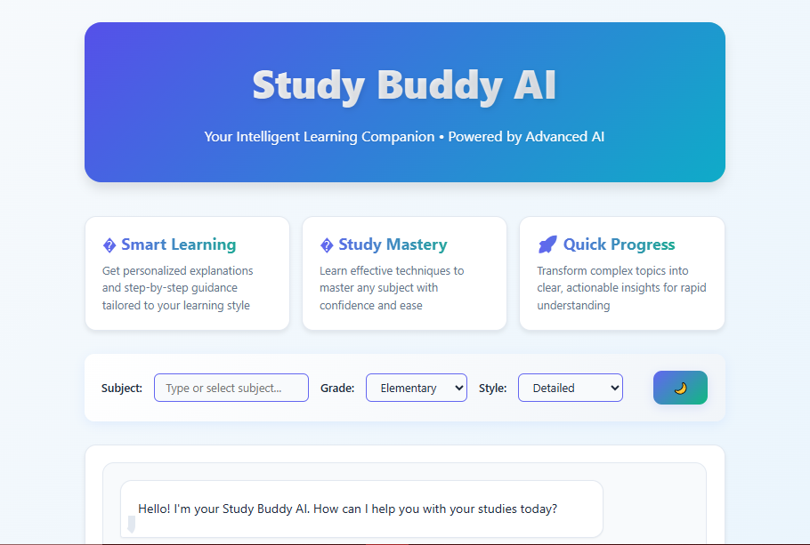
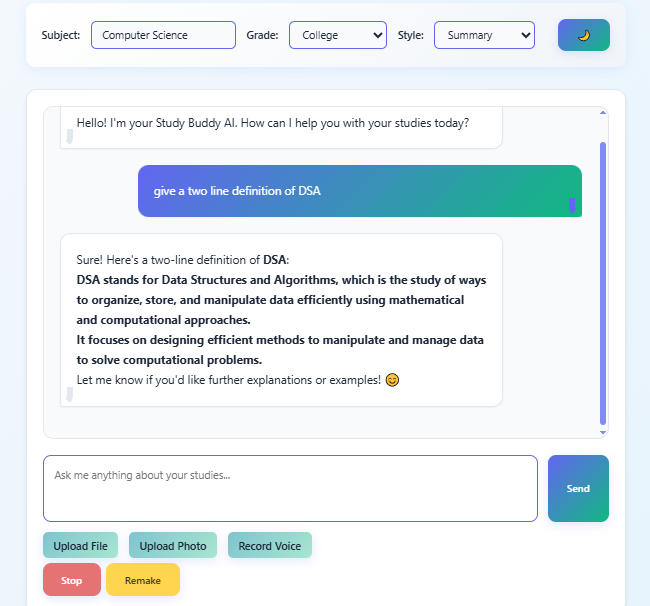
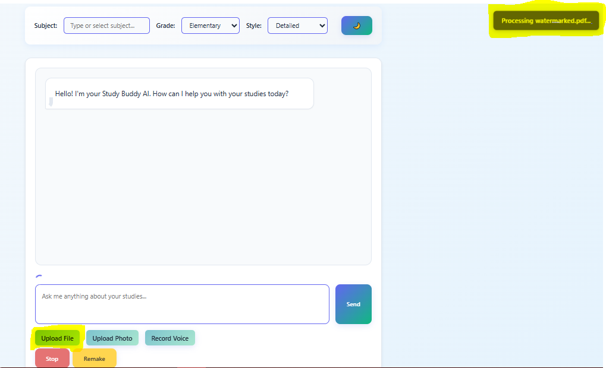
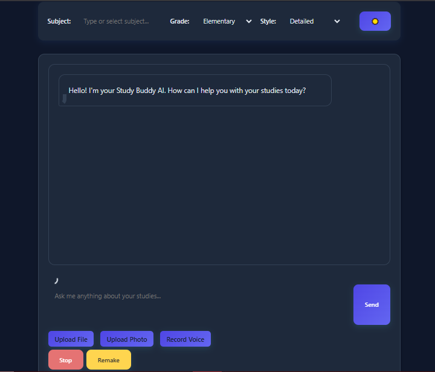
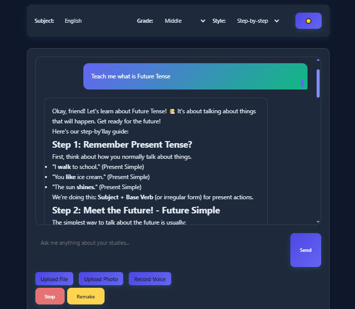
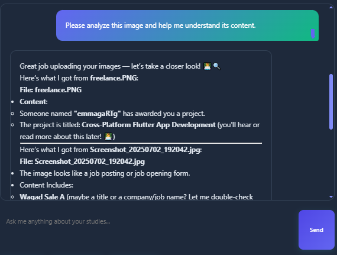

# 🎓 Study Buddy AI - Your Personal Academic Assistant

[](https://opensource.org/licenses/MIT)
[](https://developer.mozilla.org/en-US/docs/Web/JavaScript)
[](https://developer.mozilla.org/en-US/docs/Web/HTML)
[](https://developer.mozilla.org/en-US/docs/Web/CSS)

Study Buddy AI is an intelligent, multi-modal academic assistant powered by advanced AI technology. It helps students learn more effectively by providing personalized explanations, processing various file formats, and offering interactive learning experiences.



## ✨ Features

### 🤖 AI-Powered Learning
- **Intelligent Responses**: Get personalized explanations tailored to your learning style
- **Multi-Subject Support**: Covers Math, Science, English, History, Computer Science, and more
- **Grade-Level Adaptation**: Adjusts complexity from Elementary to College level
- **Multiple Learning Styles**: Detailed, Summary, Funny, and Step-by-step explanations



### 📁 Multi-Modal File Processing
- **PDF Processing**: Extract and analyze text from PDF documents
- **Word Document Support**: Process .docx files seamlessly
- **Image OCR**: Extract text from images using advanced OCR technology
- **Voice Input**: Record and transcribe speech to text



### 🎨 Modern User Interface
- **Responsive Design**: Works perfectly on desktop, tablet, and mobile devices
- **Dark/Light Mode**: Toggle between themes for comfortable viewing
- **Interactive Elements**: Smooth animations and hover effects
- **Real-time Streaming**: See AI responses as they're generated



## 🚀 Getting Started

### Prerequisites
- A modern web browser (Chrome, Firefox, Safari, Edge)
- Internet connection for AI API calls
- API key from OpenRouter AI (or compatible AI service)

### Installation

1. **Clone the repository**
   ```bash
   git clone https://github.com/assassinaj602/study-buddy-ai.git
   cd study-buddy-ai
   ```

2. **Open the project**
   - Simply open `index.html` in your web browser
   - No build process required - it's a pure HTML/CSS/JavaScript application

3. **Configure API Key**
   - Open `index.html` in a text editor
   - Find the `API_KEY` variable and replace it with your OpenRouter AI API key
   ```javascript
   const API_KEY = 'your-api-key-here';
   ```

### 🔧 Configuration

The application uses OpenRouter AI by default, but you can configure it to use other AI services:

```javascript
// API Configuration
const API_KEY = 'your-api-key-here';
const API_URL = 'https://openrouter.ai/api/v1/chat/completions';
```

## 📖 Usage

### Basic Chat
1. Select your subject, grade level, and preferred learning style
2. Type your question in the text area
3. Click "Send" or press Enter to get an AI response
4. Use "Stop" to interrupt generation or "Remake" to get a different response



### File Upload
1. **PDF/Word Documents**: Click "Upload File" and select your document
2. **Images**: Click "Upload Photo" to process images with OCR
3. **Voice**: Click "Record Voice" to convert speech to text



### Advanced Features
- **Stop Generation**: Interrupt long responses mid-stream
- **Remake Answers**: Get alternative explanations for the same question
- **Theme Toggle**: Switch between light and dark modes
- **Responsive Design**: Use on any device size

## 🛠️ Technical Details

### Built With
- **Frontend**: HTML5, CSS3, Vanilla JavaScript
- **AI Integration**: OpenRouter AI API
- **File Processing**: 
  - PDF.js for PDF processing
  - Mammoth.js for Word documents
  - Tesseract.js for OCR
- **Speech Processing**: Web Speech API & AssemblyAI

### Architecture
```
study-buddy-ai/
├── index.html          # Main application file
├── README.md          # This file
└── screenshots/       # Interface screenshots
    ├── main-interface.png
    ├── chat-interface.png
    ├── file-upload.png
    ├── dark-mode.png
    ├── basic-chat.png
    └── file-processing.png
```

### Key Features Implementation
- **Streaming Responses**: Real-time AI response display
- **File Processing**: Multi-format document analysis
- **OCR Integration**: Image-to-text conversion
- **Responsive Design**: Mobile-first approach
- **Dark Mode**: CSS custom properties for theming

## 🎯 Use Cases

### For Students
- **Homework Help**: Get explanations for difficult concepts
- **Document Analysis**: Process study materials and textbooks
- **Note Taking**: Convert handwritten notes to digital text
- **Quick Quizzes**: Generate practice questions from uploaded content

### For Educators
- **Content Creation**: Generate educational materials
- **Student Assessment**: Analyze student work and provide feedback
- **Lesson Planning**: Create structured learning content
- **Accessibility**: Convert various formats to accessible text


## 🔒 Privacy & Security

- **No Data Storage**: All processing happens in real-time
- **Client-Side Processing**: File processing occurs in your browser
- **API Security**: Uses secure HTTPS connections
- **No Personal Data**: Only chat content is sent to AI services

## 🤝 Contributing

We welcome contributions! Here's how you can help:

1. **Fork the repository**
2. **Create a feature branch**
   ```bash
   git checkout -b feature/amazing-feature
   ```
3. **Commit your changes**
   ```bash
   git commit -m 'Add some amazing feature'
   ```
4. **Push to the branch**
   ```bash
   git push origin feature/amazing-feature
   ```
5. **Open a Pull Request**

### Development Guidelines
- Follow existing code style and formatting
- Test on multiple browsers and devices
- Update documentation for new features
- Keep the single-file architecture when possible

## 📝 License

This project is licensed under the MIT License - see the [LICENSE](LICENSE) file for details.

## 🙏 Acknowledgments

- **OpenRouter AI** for providing the AI API
- **PDF.js** for PDF processing capabilities
- **Tesseract.js** for OCR functionality
- **Mammoth.js** for Word document processing
- **AssemblyAI** for speech-to-text services
- **Material Icons** for the beautiful icons

## 📞 Support

If you encounter any issues or have questions:

1. **Check the Issues**: Look for existing solutions
2. **Create an Issue**: Report bugs or request features
3. **Email Support**: contact@studybuddy-ai.com
4. **Documentation**: Check this README for detailed information

## 🔮 Future Enhancements

- [ ] Real-time collaboration features
- [ ] Extended file format support
- [ ] Custom AI model integration
- [ ] Progress tracking and analytics
- [ ] Mobile app development
- [ ] Multi-language support
- [ ] Advanced quiz generation
- [ ] Study session management

---

**Made with ❤️ for students and educators worldwide**

## 📊 Project Stats


*Last updated: July 2025*
